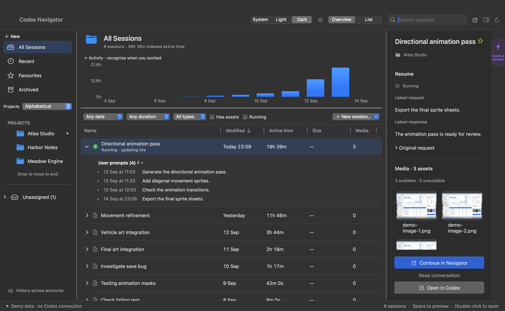
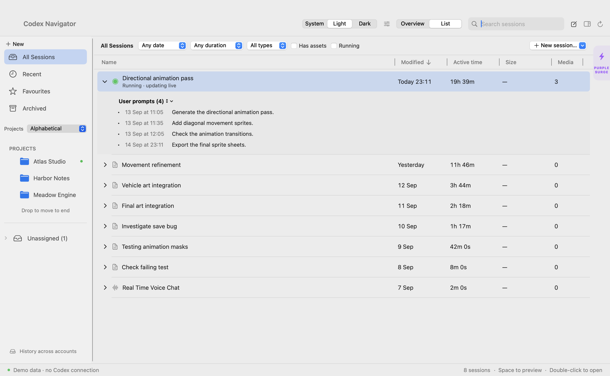

# Codex Navigator

**Find, organise, and continue your Codex tasks in a native Mac app.**

Turn your local Codex history into a browsable library. Find an earlier prompt, preview the work it produced, and pick up where you left off.



*Actual app screenshot with fictional demo data.*

[Get started](#get-started) · [User guide](docs/USER-GUIDE.md) · [Technical reference](docs/TECHNICAL-REFERENCE.md) · [Report an issue](https://github.com/danielhinkles/Codex-Navigator/issues)

## Your work, easier to find

- **Rediscover a task.** Search session names and indexed user prompts. Filter by date, activity, or media, and scan your project’s recent work.
- **Organise your library.** Pin projects, group them, favourite sessions, and arrange your sidebar. Organisation stays local to Navigator; folders and Codex assignments stay in place.
- **See where you left off.** Read the latest request and response, expand earlier prompts, and preview referenced images, documents, and other available media.
- **Continue from the same window.** Open a task in Composer, write a follow-up, and send it to Codex. Follow streaming responses, answer questions, and review approval requests.

## From finding to doing

1. **Find** a session with search or select its project in the sidebar.
2. **Review** the latest request, response, and available files in the inspector.
3. **Continue** with **Continue in Navigator**, or choose **Open in Codex**.

Prefer a simpler view? Switch to **List** for a full-width session table.

<details>
<summary>See the List view</summary>



*Actual app screenshot with fictional demo data.*

</details>

## Get started

**macOS 14+ · Swift 5.9+ · Python 3 · Local Codex installation**

Navigator currently builds from source. Install Xcode Command Line Tools with `xcode-select --install` if needed, and sign in to your Codex desktop app or CLI.

```sh
git clone https://github.com/danielhinkles/Codex-Navigator.git
cd Codex-Navigator
bash scripts/build.sh
open 'dist/Codex Navigator.app'
```

The build creates an ad-hoc signed app you can copy to `/Applications`. There is no notarised installer or automatic updater yet. The app uses `/usr/bin/python3`; no pip packages are required.

To explore with fictional data:

```sh
'dist/Codex Navigator.app/Contents/MacOS/CodexNavigator' --demo
```

See the [installation guide](docs/INSTALL.md) for requirements, updates, uninstalling, and environment overrides.

## Your data and your control

Browsing, indexing, and local file previews do not submit model turns. Navigator keeps its own library in `~/Library/Application Support/Codex Navigator/`.

Grouping, pinning, sorting, and assigning existing sessions change Navigator’s local metadata. They do not move your folders or rewrite Codex’s project assignments. Explicit **New Project** creation registers the selected folder through Codex’s project API.

Sending a prompt in Composer uses your installed Codex sign-in and provider configuration. Submitted prompts and task context are processed through Codex; execution follows task permissions and approval decisions. A disconnected prompt is never automatically resent.

**Current scope:** locally available interactive Codex sessions. ChatGPT Chat/Work and remote-host histories are not included. Live integration depends on your installed Codex version.

[Read about storage, backups, and recovery →](docs/USER-GUIDE.md#13-local-data-privacy-and-recovery)

## More when you need it

Navigator also includes prompt attachments, voice features, Quick Prompts, interactive design reviews, project launching, and appearance controls. Purple Surge adds 200 offline puzzles and an optional online arena; online play connects to the game’s website.

Explore these in the [User Guide](docs/USER-GUIDE.md). Online arena verification limits are documented in the [Purple Surge integration notes](docs/PURPLE-SURGE-IMPLEMENTATION.md).

## Documentation and contributing

| Resource | What you’ll find |
| --- | --- |
| [Install](docs/INSTALL.md) | Build, launch, update, and uninstall |
| [User guide](docs/USER-GUIDE.md) | Features, workflows, shortcuts, and troubleshooting |
| [Technical reference](docs/TECHNICAL-REFERENCE.md) | Source map, storage, IPC, and maintenance |
| [Architecture](ARCHITECTURE.md) | Indexing and update pipeline |
| [Contributing](CONTRIBUTING.md) | Development checks and contribution boundaries |

Found a bug or have an idea? [Open an issue](https://github.com/danielhinkles/Codex-Navigator/issues).

## License

[MIT](LICENSE). Codex Navigator is an independent companion project, not an official OpenAI application.
